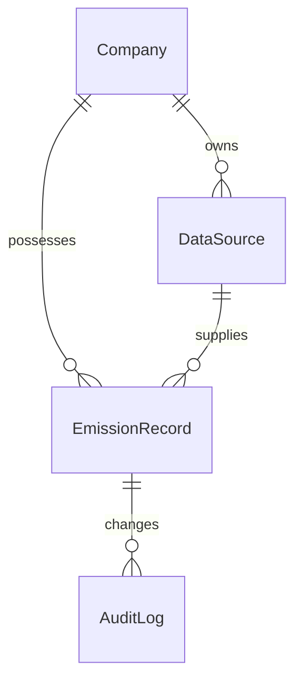

# Data Model Documentation (MODEL.md)

This document details the database architecture designed for the Breathe ESG Carbon Ingestion and Auditing backend, implemented using Django ORM. The schema is built to guarantee multi-tenancy, data integrity, auditability, and automated carbon normalization.

---

## Entity-Relationship Overview



---

## Model Specifications

### 1. `Company` (Multi-Tenancy Isolation)
Acts as the root for data isolation. In a SaaS environment, all activity logs, data sources, and emission records must be bound to a specific company.
*   `name` (CharField, 255): The legal name of the organization.
*   `industry` (CharField, 100): The industry sector (used for benchmarking).

### 2. `DataSource` (Source-of-Truth Tracking)
Represents the origin of the data ingestion. It tracks the provenance of each emission entry.
*   `company` (ForeignKey $\rightarrow$ `Company`): Owners of the source pipeline.
*   `source_type` (CharField, 20): One of `SAP` (Fuel/Procurement), `UTILITY` (Electricity), or `TRAVEL` (Corporate Flights/Hotels/Transport).
*   `uploaded_at` (DateTimeField): Timestamp of the data import.

### 3. `EmissionRecord` (Core Carbon Ledger)
The main ledger tracking raw entries and their normalized equivalents.
*   `company` (ForeignKey $\rightarrow$ `Company`): Tenant owner.
*   `source` (ForeignKey $\rightarrow$ `DataSource`): Ingestion source.
*   `category` (CharField, 100): Descriptive type (e.g. "Main Office Electricity", "Fleet Diesel").
*   `raw_value` (FloatField): The raw quantity ingested (e.g., 12000, 500).
*   `raw_unit` (CharField, 50): Raw unit of measurement (e.g. `kWh`, `Liters`, `Gallons`, `km`).
*   `normalized_value` (FloatField): Automatically computed carbon equivalent in **`kg CO2e`**.
*   `normalized_unit` (CharField, 50): Locked to `"kg CO2e"` for cross-source aggregation.
*   `record_date` (DateField): The operational date of the emission.
*   `scope` (CharField, 20): `SCOPE1` (Direct), `SCOPE2` (Indirect Electricity), or `SCOPE3` (Other Indirect).
*   `status` (CharField, 20): `PENDING` (needs review), `FLAGGED` (suspicious anomalies), `APPROVED` (finalized), `REJECTED` (invalid).
*   `is_locked` (BooleanField): Immutable protection flag. Once `True`, no updates or deletions can occur.

### 4. `AuditLog` (Immutable Transaction Trail)
Tracks every modification to an `EmissionRecord` for regulatory compliance and external auditing.
*   `record` (ForeignKey $\rightarrow$ `EmissionRecord`): Associated record.
*   `action` (CharField, 20): `CREATED`, `UPDATED`, `APPROVED`, `REJECTED`, or `LOCKED`.
*   `old_value` (FloatField, optional): Previous raw value.
*   `new_value` (FloatField, optional): Updated raw value.
*   `timestamp` (DateTimeField): Instantaneous log timestamp.

---

## Key Design & Integrity Rules

### 1. Multi-Tenant Integrity Constraint
To prevent cross-tenant data leakages, the model enforces that the associated `DataSource` must belong to the exact same `Company` as the `EmissionRecord`:
```python
def clean(self):
    if self.source and self.source.company != self.company:
        raise ValidationError("The record's company must match the data source's company.")
```

### 2. Immutability (Record Locking)
To satisfy rigorous auditing requirements, the database blocks any attempts to write or delete records once they have been approved or explicitly locked:
```python
def save(self, *args, **kwargs):
    if self.pk:
        original = EmissionRecord.objects.get(pk=self.pk)
        if original.is_locked:
            raise ValidationError("This record is locked and cannot be modified.")
    ...
```

### 3. Automated Lifecycle Normalization
Rather than relying on client-side calculations, carbon equivalents are calculated dynamically using standard GHG Protocol factors inside the database save lifecycle:
```python
self.normalized_value, self.normalized_unit = normalize_emission(
    self.scope, self.raw_value, self.raw_unit
)
```
Once approved, records are automatically marked as `is_locked = True`.
